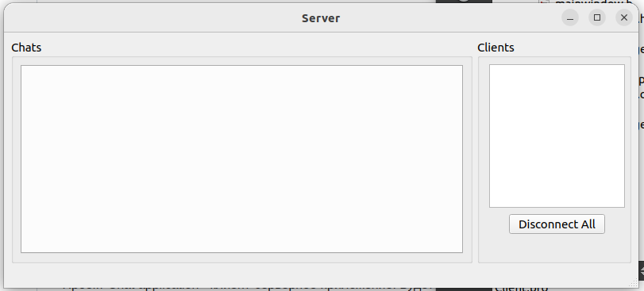

# Chat_application

Очередной тренировочный проект для изучения и укрепления понимания Qt архитектуры и способов создания приложений.

Проект Chat application - клиент-серверное приложение. Будет использоваться jTCP протокол.

Текущий результат:

